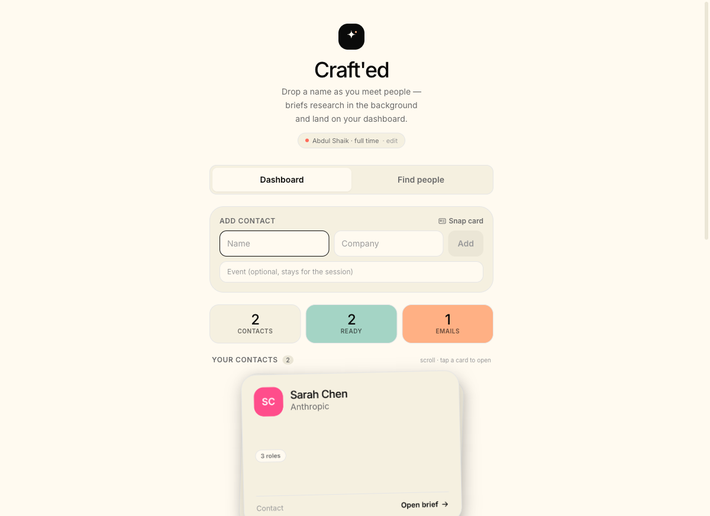
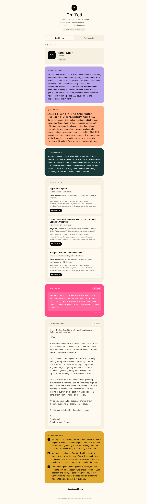

# Craft'ed

**Meet someone at an event → a warm, researched follow-up before you leave the room.**

Craft'ed is a self-hosted networking tool. At an event you drop a name + company (or snap a business card), and it runs in the background to produce a researched intel brief — who they are, their company, why to follow up, open roles that fit *you*, a verified email, and ready-to-send LinkedIn DM + follow-up email. Briefs land on a dashboard so you can capture the next person without waiting.

It's **bring-your-own-keys**: clone it, add your API keys, and run it locally with `docker compose up` or [deploy it](DEPLOY.md) to use from your phone at an event. Every integration degrades gracefully — the only key you truly need is Anthropic.

---

## Features

- **Event dashboard** — drop a name + company, it queues and processes in the background; briefs populate as they finish
- **Persona-driven** — onboard once (name, goal, resume); every brief, DM, and job match is tailored to *you* (internship / full-time / collaboration / mentorship)
- **Live research** — person + company researched from the web (Tavily), not a stale database
- **Find people** — search "Solutions Engineers at Anthropic" or "speakers at AWS Summit" → discover contacts, then craft a follow-up
- **Job matching** — scans the contact's company (Greenhouse/Lever/Ashby) for roles that fit your resume, with description briefs + apply links
- **Verified emails** — finds a deliverable work email (Prospeo)
- **Ready-to-send outreach** — LinkedIn DM (<300 chars), follow-up email, talking points
- **Persistent** — persona + contact history saved to your own Supabase (or local fallback)

---

## Screenshots

| Event dashboard | Intel brief |
|---|---|
|  |  |

Drop a name → it processes in the background and lands on the dashboard as a card.
Tap a card to open the full brief: who they are, company, why to follow up, open
roles that fit you (with apply links), a verified email, and ready-to-send DM + email.

---

## How it works

```
name + company (or card photo)
        │
        ▼  OCR (Claude Vision, if a card)
   resolved contact
        ├───────────────┬───────────────┐
        ▼               ▼               ▼
  web research      job scan        email find
  (Tavily+Claude)   (ATS APIs)      (Prospeo)
        └───────────────┴───────────────┘
                        ▼  synthesis (Claude)
                   Intel brief + outreach  →  dashboard
```

---

## Tech stack

- **Backend** — FastAPI (Python 3.10+), async pipeline, Anthropic Claude
- **Frontend** — Next.js 14 + TypeScript + Tailwind
- **Data** — Supabase (Postgres) with local JSON/localStorage fallback

---

## Quickstart

### Prerequisites
- **Python 3.10+** (the API uses `X | None` runtime annotations)
- **Node.js 18+**
- An **Anthropic API key** (required). Everything else is optional.

### 1. Backend
```bash
python3 -m venv .venv
source .venv/bin/activate            # Windows: .venv\Scripts\activate
pip install -r requirements.txt
cp .env.example .env                  # then edit .env (see Keys below)
uvicorn app.main:app --reload --port 8000
```

### 2. Frontend
```bash
cd web
npm install
cp .env.example .env.local            # NEXT_PUBLIC_API_URL=http://localhost:8000
npm run dev
```

Open **http://localhost:3000**.

### Or run both with Docker (one command)
```bash
cp .env.example .env                  # add ANTHROPIC_API_KEY (others optional)
docker compose up --build             # API on :8000, web on :3000
```
Open **http://localhost:3000**.

---

## Deploy (use it at an event)

`docker compose` and the local steps above run on **localhost** — fine for trying
it, but to actually use Craft'd at an event you're on your **phone**, which can't
reach your laptop's localhost. For that, deploy the two services (API + web) to a
host with HTTPS.

The code is deploy-ready: the API binds to the host's `$PORT`, and CORS is driven
by `CORS_ORIGINS`. **See [DEPLOY.md](DEPLOY.md)** for step-by-step **Render** and
**Railway** recipes, including the two things that trip people up:

- `NEXT_PUBLIC_API_URL` (the web app's pointer to the API) is **baked in at build
  time** — change it and the web service must *rebuild*.
- `CORS_ORIGINS` on the API must list your web URL exactly (scheme + host, no
  trailing slash), or the browser blocks every request.

> **Using Claude Code?** Run `/deploy` in the repo — the bundled skill
> (`.claude/skills/deploy/`) walks the whole deploy interactively and verifies it.

For deployed events, also set `SUPABASE_URL` + `SUPABASE_KEY` (see below) so
captured contacts survive redeploys — the local fallback is ephemeral in a container.

---

## Keys (bring your own)

Only **Anthropic is required**. Each other key unlocks a feature; without it that feature degrades gracefully.

| Key | Required? | Unlocks | Get it |
|---|---|---|---|
| `ANTHROPIC_API_KEY` | **Yes** | Card OCR + brief/DM/email generation | [console.anthropic.com](https://console.anthropic.com) |
| `TAVILY_API_KEY` | No | Live person/company research (else public data only) | [tavily.com](https://tavily.com) (free tier) |
| `PROSPEO_API_KEY` | No | Verified email lookup | [prospeo.io](https://prospeo.io) (free tier) |
| `EXA_API_KEY` | No | "Find people" discovery | [exa.ai](https://exa.ai) (pay-as-you-go) |
| `APIFY_API_TOKEN` | No | LinkedIn job fallback (off-ATS companies) | [apify.com](https://apify.com) |
| `SUPABASE_URL` + `SUPABASE_KEY` | No | Persist persona + contacts (else local fallback) | see below |

Run with just `ANTHROPIC_API_KEY` and you still get the full brief from public data + free ATS job boards.

---

## Optional: persistence with Supabase

Without Supabase, runs persist to a local `.craftd_runs.json` and your persona to browser `localStorage`. To persist server-side (and across browsers), create a free [Supabase](https://supabase.com) project, run this in its **SQL Editor**, then add `SUPABASE_URL` + the **service_role** key to `.env`:

```sql
create table if not exists personas (
  device_id text primary key,
  name text not null, position text not null, goal text not null,
  resume_summary text, skills jsonb default '[]'::jsonb,
  target_roles jsonb default '[]'::jsonb,
  updated_at double precision default extract(epoch from now())
);
create table if not exists runs (
  id text primary key, device_id text not null,
  name text, company text, title text, event_name text,
  status text not null default 'queued', report jsonb, error text,
  created_at double precision default extract(epoch from now()),
  updated_at double precision default extract(epoch from now())
);
create index if not exists runs_device_idx on runs (device_id, created_at desc);

-- Enable Row Level Security with no policies. The backend uses the service_role
-- key, which bypasses RLS, so the app keeps working — but this blocks the public
-- anon key from reading/writing these tables (which hold names, emails, and
-- reports). Without this, Supabase warns and the data is exposed via its API.
alter table personas enable row level security;
alter table runs        enable row level security;
```

> The backend uses the `service_role` key (backend-only, never sent to the browser), which bypasses RLS — so RLS-on with no policies keeps the app working while locking out the public anon key. For a shared multi-user deployment you'd instead add Supabase Auth + device/user-scoped RLS policies.

---

## Project structure

```
app/                 FastAPI backend
  api/routes.py      endpoints
  models/pipeline.py typed pipeline models
  services/          ocr · research · jobs · email · discovery · report · queue
web/                 Next.js frontend
  app/page.tsx       dashboard + onboarding
  components/        Dashboard, ResultBrief, FindPeople, Onboarding, ...
```

---

## Notes & limits

- **Personal/pilot scope.** Single-user per instance, scoped by a per-browser `device_id` (no auth). Self-host one instance per person.
- **Find people** returns *published* people (employees, speakers, sponsors) — there's no public source for full event attendee lists.
- **Email finding** hits best on standard corporate patterns; some contacts won't resolve (you'll just see no email, never a guess).
- API usage is billed to **your** keys.

---

## Responsible use

Craft'd researches real people and can surface verified emails, so use it like a
considerate human, not a spam cannon:

- **Built for warm follow-ups** — people you actually met (a card, a conversation).
  That's the intended, consent-adjacent use.
- **It's a tool, not a free pass.** A data source being legal doesn't make every
  use of it okay. Cold-emailing strangers can implicate **CAN-SPAM (US)** and
  **GDPR/PECR (EU)** regardless of where the address came from.
- **Review before you send.** Every draft is yours to edit — keep messages honest;
  don't imply familiarity that isn't real.
- **Honor "no."** Don't contact people who've opted out, and don't mass-blast.
- **"Find people" is for research/intros**, not building a cold-email list.
- **Personal vs. commercial.** Personal, low-volume, self-hosted use is low-risk.
  If you host it for others or send at scale, add a privacy policy, a lawful basis,
  data-deletion handling, and email opt-outs — and talk to counsel.

You bring the keys and run your own instance; you own how it's used.

---

## License

MIT — see [LICENSE](LICENSE).
